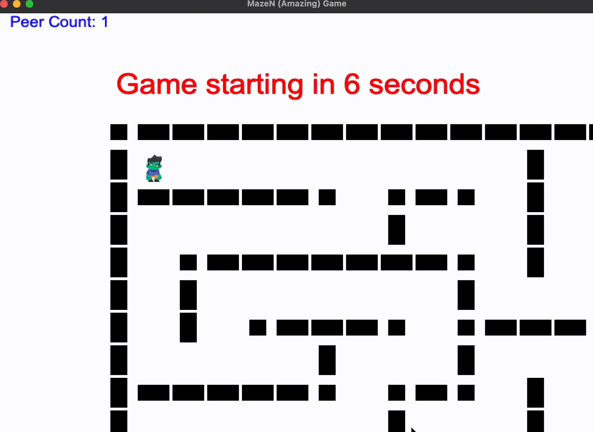

# MazeN 
MazeN (Amazing) is a multiplayer game created by [Vlad Dobrescu](https://github.com/vlad-dobrescu) and [Alesia Vlasiu](https://github.com/alesia-vlasiu). The game is written entirely in python

## Game Description
You can either start a new game (becoming the host) or connect to an existing game by entering a connected player's address and port. After entering a game, you spawn in the top left corner cell of a randomly generated maze. The goal of the game is to reach the bottom right corner cell of the maze. After a connected player reaches the end, the game restarts with a new maze.

## Networking features
 * **Peer-to-Peer network** 
 * **Host migration**
 * **Lock-step simulation**
 * **UDP**
   

## Game Features
* **Movement:** "W, A, S, D" or arrows for movement
* **Countdown:** At the start of every game, there is a visible countdown to allow time for players to connect before the game starts. Movement is restricted while the countdown is active.
* **Portals:** Any player has the ability to place one portal per match by pressing the spacebar. The portal is a hardly visible square.
   * **Portal Collision:** If an opponent collides with your portal, they will be teleported back to the starting cell.
   * **Destroy Portals:** If you spot somebody's portal and you are situated in the same cell as the portal, you unlock the ability to destroy it by pressing 'X' on your keyboard. This action will not only destroy the portal but also teleport the player who placed it to the destroyed portal's coordinates.
* **Maze:** The maze generation is done using the Randomized Depth First Search Algorithm
  
* **Peer count:** The number of connected peers is displayed in the top left corner of the screen at all times

* **Hide opponents:** Press "I" to hide opponents for a better game fluidity, if needed

## Game UI
  
  
## Setup

1. Ensure that you have python arcade installed 
```bash
pip install arcade
```
2. Clone this repository on your machine
3. Run the following file:
```bash
python net.py
```
  
